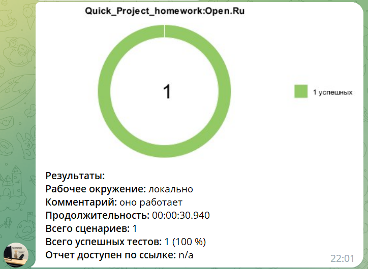

# Комплект автотестов для проверки работы элементов сайта банка "Открытие" [www.open.ru](https://www.open.ru)
### Технологический стек
________
                     

-----
* Написан на ``Java`` с использованием фреймворка ``Selenide``
* Применяется фреймворк для модульного тестирования ``JUnit 5``
* ``Gradle`` используется для автоматизированной сборки проекта
* Пока тесты запускаются только локально (сайт недоступен для сервера Selenoid вне России)
* Система ``Allure Report`` формирует отчет о запуске тестов
* ``Telegram``-бот отправляет уведомление о результатах прохождения тестов

###  Содержание тест-кейсов
Проверяем:
1) заголовок первого раздела сайта,
2) заголовки разделов на английской версии сайта,
3) работу поиска по сайту при введении запроса в поисковую строку,
4) корректность мин/макс значений сумм в онлайн-калькуляторе вкладов,
5) корректность отображаемых курсов покупки и продажи USD в отделениях,
6) корректность URL страницы Интернет-банка для частных лиц,
7) невозможность авторизации в Интернет-банке с заведомо некорректными авторизационными данными

###  Формирование отчета **"Allure Report"** локально:

 

 

###  Уведомления о прохождении тестов в Telegram отправляем локально:

  